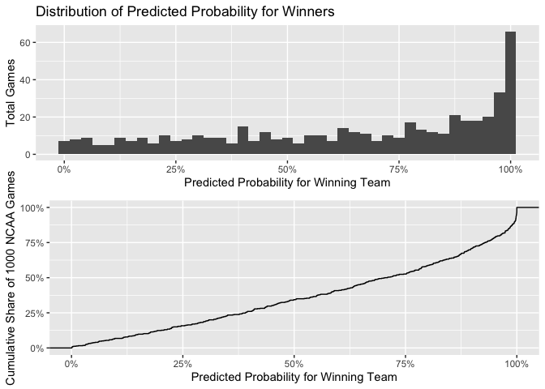

Simple Bayesian Model for Predicting Tourney Results
================
Josh Hanson

------------------------------------------------------------------------

## **Quick Explanation of Model**

------------------------------------------------------------------------

This model will use a simple Bayesian Framework for estimating the
number of points each team will score in one game. Every team’s scoring
statistics (2 PT FGs, 3 PT FGs, and FTs scored) will be summarized for
the entire season to the tournament, as well as statistics related to
their defensive performance (3 PT FGs, 2 PT FGs, and FTs allowed).

From these summaries, we will use a Bayesian Model that uses an
opponent’s defensive statistics as our prior for points that a team
might score. The likelihood will be a team’s offensive statistics. These
two distributions will then be combined to generate the posterior
distribution for a team’s total points scored.

From this posterior distribution for points scored, we will generate 1
million simulations and observe how many times one team outscores the
other. From these simulations, we can generate probabilistic statements
on the outcome of a game.

Lastly, we will be modeling points scored with the Gamma/Poisson
Conjugate Family. Although I’m aware of literature that calls into
question the efficacy of modeling points scored with a Poisson
distribution, for the purposes of this exercise, I’m going to assume
away these questions.

------------------------------------------------------------------------

## **Data Building**

------------------------------------------------------------------------

First, I aggregate our detailed season data by season and team. The
FUNCTION below provides me with a summary for points scored and points
allowed by every team and every season in our data. You can find the
logic for this function in my project folder.

``` r
summary <- cleanSeasonData(detailed_season_results)[[1]]
games <- cleanSeasonData(detailed_season_results)[[2]]
```

I now take the aggregated data and join it to the historical tourney
results by team and season. This function can also be studied in my
project folder.

We will generate our historical predictions from this dataset and
analyze how they compare to the actual observed results.

``` r
tourney <- seasonToTourney(summary)
```

------------------------------------------------------------------------

## **Model Example**

------------------------------------------------------------------------

This is all a bit abstract, so lets take a look at a few examples.
Because I am from Lawrence, Kansas and am a huge Jayhawks fan, I’m going
to illustrate my model with the 2008 Final Four game between North
Carolina and Kansas.

First, lets examine the simple model for total 2 PT FGs that Kansas
might expect to score in the game and compare that to the total 2 PT FGs
that North Carolina might expect to score in the game. From the simple
table below, we can see that prior to the post-season, Kansas averaged
\~23 FGs per game while allowing only 14 FGs per game. North Carolina
averaged \~26 FGs per game but allowed nearly 20.

We take these simple summary statistics and model a gamma distribution
for total 2PT FGs scored using the opposing team’s defense (Avg Opp
FGM2) as the prior and the team’s offensive statistics (Avg FGM2) as the
likelihood. These are then combined to form a posterior distribution
that serves as our range of possible points scored by a given team.

<table>
<caption>
Simple Summary Statistics: 2 PT FGs Made and Allowed
</caption>
<thead>
<tr>
<th style="text-align:right;">
Team ID
</th>
<th style="text-align:left;">
Team Name
</th>
<th style="text-align:right;">
Season
</th>
<th style="text-align:right;">
Total Games Played
</th>
<th style="text-align:right;">
FGM2
</th>
<th style="text-align:right;">
Opponent FGM2
</th>
<th style="text-align:right;">
Avg FGM2
</th>
<th style="text-align:right;">
Avg Opp FGM2
</th>
</tr>
</thead>
<tbody>
<tr>
<td style="text-align:right;">
1242
</td>
<td style="text-align:left;">
Kansas
</td>
<td style="text-align:right;">
2008
</td>
<td style="text-align:right;">
33
</td>
<td style="text-align:right;">
748
</td>
<td style="text-align:right;">
467
</td>
<td style="text-align:right;">
22.66667
</td>
<td style="text-align:right;">
14.15152
</td>
</tr>
<tr>
<td style="text-align:right;">
1314
</td>
<td style="text-align:left;">
North Carolina
</td>
<td style="text-align:right;">
2008
</td>
<td style="text-align:right;">
34
</td>
<td style="text-align:right;">
895
</td>
<td style="text-align:right;">
671
</td>
<td style="text-align:right;">
26.32353
</td>
<td style="text-align:right;">
19.73529
</td>
</tr>
</tbody>
</table>

Below, you can find the prior, likelihood, and posterior distributions
visualized for both teams. You can see that Kansas has a slight edge
here, despite North Carolina historically scoring many more 2 PT FGs per
game.

This is because the expectations for Kansas’ very good defense mix with
the expectations for North Carolina’s very good offense and the result
is a distribution somewhere in the middle. On the other hand, North
Carolina’s less impressive defense typically allows somewhere near the
points Kansas typically scores, meaning our expectations for the
posterior don’t shift much when predicting Kansas’s total points scored.

From these models, we generate 1 million random draws and observe the
proportion of times Kansas records more 2 PT FGs than North Carolina.
When we do this, we find that Kansas records more 2 PT FGs 86% of the
time. Thus, we can assign an 86% probability to Kansas recording more 2
PT FGs than North Carolina.

<!-- -->

Interestingly enough, North Carolina recorded 19 2-PT FGs during that
game, which is a value within the left tail of our predictive posterior
distribution. Additionally, during the regular season, North Carolina
saw only 5% of their games with lower 2 PT FGs.

Kansas recorded 29 field goals, which is far above any predicted value
and a value higher than many of their games during the regular season.
In fact, Across 33 games, Kansas only recorded 29 or more FG2 \~6% of
the time.

The above is a great example of why sports are sometimes just a bit
unpredictable, irregardless of the sophistication of our models. In this
case, one team performed far above any expectations we might have for
them while another performed far below any expectations we might
have…and this was a Final Four game!

As we’ve all heard before…all models are wrong, some are useful. In this
instance, although the model was wrong with regards to total 2PT FGs
made, it did successfully predict the binary outcome of one team having
more 2 PT FGs. That alone is pretty cool.

<!-- -->

The same exercise is carried out for every type of FG (2 PT, 3 PT, and 1
PT FT). From our estimates for total FG-types scored, we can estimate
the total points scored as simply the sum of 2 PT FGs, 3 PT FGS, and FTs
made. Once we have these estimates for total points scored, we can count
the number of times one team scores more points than the other across
our 1 million simulations.

Using this model, we estimate Kansas wins 75% of the time. Indeed, they
did win.

<!-- --><!-- -->

Kansas went onto play Memphis in the title game and win the national
championship in overtime. What would our models have predicted for this
game? Our models show this being a clear toss-up, with Memphis winning
51% of simulations and Kansas winning 49% of simulations.

Digging a little deeper, our model predicts that it is extremely
unlikely that Kansas would make more 3PT FGs than Memphis, but could
potentially make up for this difference with free-throws and 3-point
FGs. This is exactly what we saw, as Memphis made 3 more 3-point FGs
than Kansas, but 7 less 2 PT FGs and 2 less free-throws.

<!-- --><!-- -->

------------------------------------------------------------------------

## **Examination of 2008 NCAA Tournament Results**

------------------------------------------------------------------------

The 2008 Tournament was full of thrilling games and huge upsets. Would
this model have predicted any of them?

One of the biggest cinderella performances of that year was a run made
by Davidson. Despite being a 10th seed, they advanced all the way to the
Sweet 16 before losing to Kansas (the eventual champion). Along the way,
they defeated some traditionally high-performing programs like Gonzaga,
Georgetown, and Wisconsin.

Our model would have given Davidson \~55% probability of defeating
Gonzaga, \~68% probability of defeating Georgetown, and a \~48%
probability of defeating Wisconsin. It would have then only given
Davidson an 8% chance of defeating Kansas Jayhawks. All in all, it would
have nearly perfectly predicted Davidson’s run.

<!-- -->

<!-- -->

<!-- -->

<!-- -->

Another cinderella story from that year was Western Kentucky. Would this
modeling approach have predicted their run? Arguably, Western Kentucky
was mostly the beneficiary of other upsets and beat two rather weak
teams on their run to the Sweet 16. My model seemed to have picked up on
that.

Western Kentucky would be given a 55% probability of winning against
Drake and a 98% probability of winning against San Diego. They did both
of those things. It would have then given them only \~19% probability of
beating UCLA. UCLA did indeed go onto defeat Western Kentucky, thus
ending their cinderella run.

<!-- -->

------------------------------------------------------------------------

<!-- -->

------------------------------------------------------------------------

<!-- -->

------------------------------------------------------------------------

Although this model seems to have the ability to capture a few upsets,
it also missed a few. Namely, it would have only given West Virginia a
25% probability of defeating Duke. Although not horrible odds, a perhaps
higher than others might have give them, it wouldn’t help me make a
prediction against Duke.

<!-- -->

Additionally, it would have given Siena a 45% probability of defeating
Vanderbilt in the first round. Although this is arguably a toss-up from
a probabilistic viewpoint, and is perhaps also higher probabilities than
most would have given them, toss-ups don’t matter when we are using
these probabilities to define binary predictions.

<!-- -->

------------------------------------------------------------------------

## **Testing Historical Performance**

------------------------------------------------------------------------

In order to test the true performance of this model, I can take 1000
random games from previous tournaments and compare my prediction to the
actual observed result.

Our model successfully predicted the outcome of a game nearly 67% of the
time. Although not perfect, this isn’t too shabby and is a bit above
what you might expect from randomly choosing results.

    ## `summarise()` ungrouping output (override with `.groups` argument)

<!-- -->

Additionally, the model doesn’t often grossly underestimate a team’s
probability of winning when they go onto win. A great majority of
probability estimates for the winning teams are above 50% with very few
(&lt;13%) below 25%.

<!-- -->

------------------------------------------------------------------------

## **Optimization Attempts**

------------------------------------------------------------------------

It could be the case that defense is being overweighted in our model. To
test this, we could weight the influence of a team’s offensive
performance more than that of the defensive performance, implying we
think a team’s historical offensive performance is a slightly better
predictor than their defensive performance. We could then compare the
successful prediction rates across a set of different weightings.

This exercise was performed and it was found to be very true. This
model’s prediction power is optimized near a weighting of \~35%, where
prediction accuracy settles around 80-83%. This is a tremendous
improvement of the previous model, which saw success rates \~67%.

<!-- -->

Predictions rates across our different seed spreads are, as expected,
also greatly improved. We have an 80% accuracy for any games involving
seed spreads between -15 and -1. For games with a spread of 0, we have
an accuracy of 70%, which seems very good for games that most would
consider a coin-toss. For upsets (seed spreads between 1 and 8), we have
success rates above 50%.

<!-- -->

Although more research is needed, this drastic improvement might be
explained by a few interesting anecdotals. One great example is the
Davidson vs Wisconsin matchup from 2008 that we described earlier.
Although our old model gave Wisconsin a slight advantage, our new model
gives Davidson a far greater probability of winning. Our new model would
have given Davidson a 90% chance of victory compared to the previous
estimate of 48%.

<!-- -->
